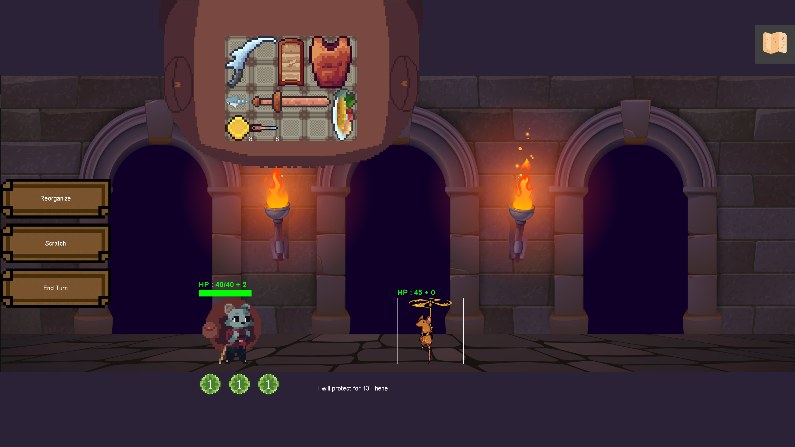
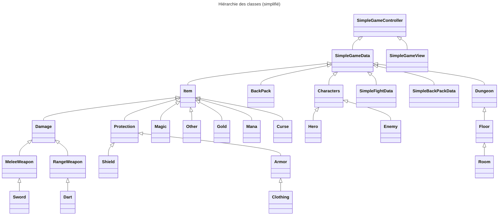

# BackPack Hero !

Projet de BUT Informatique codé en `Java` et réalisé par en binome.

# Règles du jeu
Le but de ce projet est de réaliser une version simplifiée du jeu Backpack Hero. Il s’agit d’un jeu pour un seul joueur : le héros doit explorer un donjon peuplé de monstres et de trésors, et ne pourra s’aider que du matériel que l’on transporte dans son sac à dos. C’est un jeu de type rogue-like dont une des composantes principales consiste en du placement de tuiles qui interagiront ; la nature de ces interactions sera décrite dans les sections ci-dessous.

## Ce qui a été implémenté
**Dans le jeu :**
 - [x] Le héro avec son backpack et la trash
 - [x] Translater et rotate les objets
 - [x] Les combats avec les coûts des actions et les ennemis
 - [x] Interfaces pour les différents types d'objets (épée, bouclier, plastron, Or, Mana, Fléchette)
 - [x] Le donjon avec les différents étages et salles
 - [x] La gestion des events (combats, healer, merchant)
 - [x] Implémentation de nouveaux items avec différentes raretées
 - [x] Ajout de nouveaux ennemis (ainsi que leur apparition en fonction de leu niveau de difficulté)
 - [x] Interaction entre les equipements (Mana)
 - [x] Effets de combat
 - [x] Curses
 - [x] Drop d'items et gain d'expérience

**Dans l'interface :**
 - [x] Affichage du jeu avec le héro
 - [x] La map générée de manière aléatoire
 - [x] Le backpack
 - [x] Contenus des salles (marchand, healer, combats, trésors)
 - [x] Interaction avec le clic de la souris
 - [x] Combat entièrement interactif
 - [x] Affichage du détail du l'item sélectionné
 - [x] Interaction avec le clavier pour choisir son nom au début du jeu
 - [X] Affichage du Hall Of Fame en fin de partie

## Organisation du programme

▷ Une classe SimpleGameData est utilisée pour gérer les données du jeu (le modèle) ainsi que toutes les actions possibles, suivant les règles du jeu.
▷ Une interface GameView implémentée par le record SimpleGameView permet de gérer l’affichage graphique (la vue).
▷ Le contrôleur implémente la boucle de jeu et la gestion des événements utilisateur : clics, touches, ...

## Choix techniques et algorithmiques

|Choix techniques           |Raisons                                                         |
|---------------------------|----------------------------------------------------------------|
|`Java 19`                  |Imposé dans le cadre de ce projet                               |
|`Zen 5`                    |Pour l'interface graphique car imposé dans le cadre de ce projet|
|`Eclipse`                  |Pour le développement                                           |

- - -

|Choix algorithmiques                           |Raisons                            |
|-----------------------------------------------|-----------------------------------|
|`Exploitation du modèle de développement MVC`  |Imposé dans le cadre de ce projet  |
|`Aucune utilisation de instanceof`             |Utilisation du polymorphisme       |
